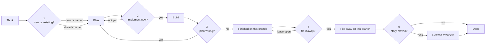

# Lifecycle gates

This pack uses OpenSpec for change planning (`proposal` → specs → apply → sync → archive). Without a close-out, code can land while living specs stay stale. The overview then mixes product intent, old SHALL text, and current code.

These **five asks** are a human checkpoint in the normal ship loop. The agent stops and asks only when the next step is hard to undo. Default is keep working. Not a weekly ritual. Not a prompt on every commit.

The playbook is IDE-agnostic. It lives in `skills/openspec-lifecycle-gates/SKILL.md`.

---

## The loop

Most boxes are work. Diamonds are the only times the agent must stop and ask.

Typical coding day: **zero prompts**. Day something is ready to file away: **one** (ask 4). Overview only if the product story or a public URL actually moved.

Stay on the current branch. Do not switch to `main` to file a change away. The OpenSpec files go in the same PR as the code. The work is done only when the code and those files on **this** branch match.

Before a **finished** commit: the agent runs lint and build. Do not ask the user to run those. Do not commit until they pass. Before pushing a PR: the agent runs tests. Do not push until they pass. This is extra, in chat — not a new git hook.

---

## The five asks

| # | Name | When it fires | What the agent asks | Why | Skip if |
| --- | --- | --- | --- | --- | --- |
| 1 | New work vs existing change | Before any OpenSpec files are created | New change, or fold into an existing one? | Wrong ticket folder is expensive to unwind | They already named the change |
| 2 | Start coding | Plan is done; they have not said to implement | Implement now, or keep it as a plan? | Planning is cheap. Implementing touches the app | They already said to implement |
| 3 | The ticket is wrong | Code and the written plan disagree, including after extra product tweaks | Update the plan, or keep the old plan? | Silent scope change is how docs lie | The work still matches the plan |
| 4 | The work landed | Tasks done on this branch, folder still in `changes/` | File it away on this branch, or leave it open? | That is how living specs stay true | The change is incomplete |
| 5 | The story changed | After it is filed away, only if a use case or URL moved | Refresh the product overview, or leave it? | The one-pager is for humans, not every spec tweak | The story did not move |

After a yes (still on this branch):

1. Propose a new change, or update an existing one
2. Implement (`openspec-apply`)
3. Update the plan, or keep applying the spec as written
4. Copy deltas into `openspec/specs/`, then move the change folder into archive. If they already said yes to both in one answer, do both. Do not ask again “copy the spec first?”
5. Edit `openspec/application-overview/overview.md` only

If they open the overview before the change is filed away: say what would need to change, and wait.

When a round of extra tweaks is over, say in one sentence what the next ask is. Do not wait for them to name this skill.

---

## What we refuse to prompt on

- Every tiny save or mid-bugfix
- After they already said yes
- Incomplete work
- Overview refresh when the story did not move
- Replacing the picker with only a numbered list in chat when this tool has a picker

If the agent is merely unsure, it should **keep working**, not ask. False positives are what make this interruptive. Changing the product so it no longer matches the written plan is not “just unsure” — that is ask 3.

---

## What this pack includes

| Piece | Role |
| --- | --- |
| `skills/openspec-lifecycle-gates/SKILL.md` | Canonical playbook (name + description YAML) |
| `skills/openspec-lifecycle-gates/references/workflow.md` | Longer human write-up |
| `/lifecycle-check` | Optional Cursor shortcut |
| `AGENTS.md` | Always-on pointer |
| `openspec/` | Empty spec-driven scaffold |

Humans digest a clickable picker better than a numbered list. In Cursor, use the AskQuestion tool. Do not replace the picker with only `1. 2. 3.` in chat. If this tool has no picker, fall back to numbered options, then wait. Silence is not yes. A yes covers only the files and action that were named.

OpenSpec already owned sync and archive. Lifecycle gates only decide **when to stop and ask**.

This pack does not install the OpenSpec CLI. If the CLI is missing, the agent shows `npx @fission-ai/openspec@latest --version` and waits. The human runs that command.
