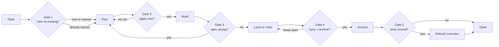

# Lifecycle gates

This pack uses OpenSpec for change planning (`proposal` → specs → apply → sync → archive). Without a close-out, code can land on `main` while living specs stay stale. The overview then mixes product intent, old SHALL text, and current code.

These **five gates** are a human checkpoint in the normal ship loop. The agent stops and asks only when the next step is hard to undo. Default is keep working. Not a weekly ritual. Not a prompt on every commit.

The playbook is IDE-agnostic. It lives in `skills/openspec-lifecycle-gates/SKILL.md`.

---

## The loop

Most boxes are work. Diamonds are the only times the agent must stop and ask.

Typical coding day: **zero prompts**. Day something lands: **one** (gate 4). Overview only if the product story or a public URL actually moved.

---

## The five gates

| # | Gate | When it fires | What the agent asks | Why | Skip if |
| --- | --- | --- | --- | --- | --- |
| 1 | New work vs existing change | Before any OpenSpec files are created | New change, or fold into an existing one? | Wrong ticket folder is expensive to unwind | They already named the change |
| 2 | Start coding | Plan is done; they have not said apply | Apply now, or keep it as a plan? | Proposing is cheap. Applying touches the app | They already said apply |
| 3 | The ticket is wrong | Code and spec disagree, and scope would change | Update the plan, or ship the spec as written? | Silent scope change is how docs lie | The work still matches the spec |
| 4 | The work landed | Tasks done, code on `main`, folder still in `changes/` | Sync + archive, or leave it open? | That is how living specs stay true | The change is incomplete |
| 5 | The story changed | After archive, only if a use case or URL moved | Refresh the product overview, or leave it? | The one-pager is for humans, not every spec tweak | The story did not move |

After a yes:

1. Propose a new change, or update an existing one
2. Apply (`openspec-apply`)
3. Update the plan, or keep applying the spec as written
4. Sync deltas into `openspec/specs/`, then archive the change folder
5. Edit `openspec/application-overview/overview.md` only

---

## What we refuse to prompt on

- Every commit or test
- Mid-bugfix / lint
- After they already said yes
- Incomplete work
- Overview refresh when the story did not move

If the agent is merely unsure, it should **keep working**, not ask. False positives are what make this interruptive.

---

## What this pack includes

| Piece | Role |
| --- | --- |
| `skills/openspec-lifecycle-gates/SKILL.md` | Canonical playbook (name + description YAML) |
| `skills/openspec-lifecycle-gates/references/workflow.md` | Longer human write-up |
| `/lifecycle-check` | Optional Cursor shortcut |
| `AGENTS.md` | Always-on pointer |
| `openspec/` | Empty spec-driven scaffold |

A skill cannot draw a native IDE dialog. The portable contract is **numbered options in chat**, then wait. If this tool has a choice form, also show it. Do not rely on the form alone. Silence is not yes. A yes covers only the files and action that were named.

OpenSpec already owned sync and archive. Lifecycle gates only decide **when to stop and ask**.

This pack does not install the OpenSpec CLI. If the CLI is missing, the agent shows `npx @fission-ai/openspec@latest --version` and waits. The human runs that command.
